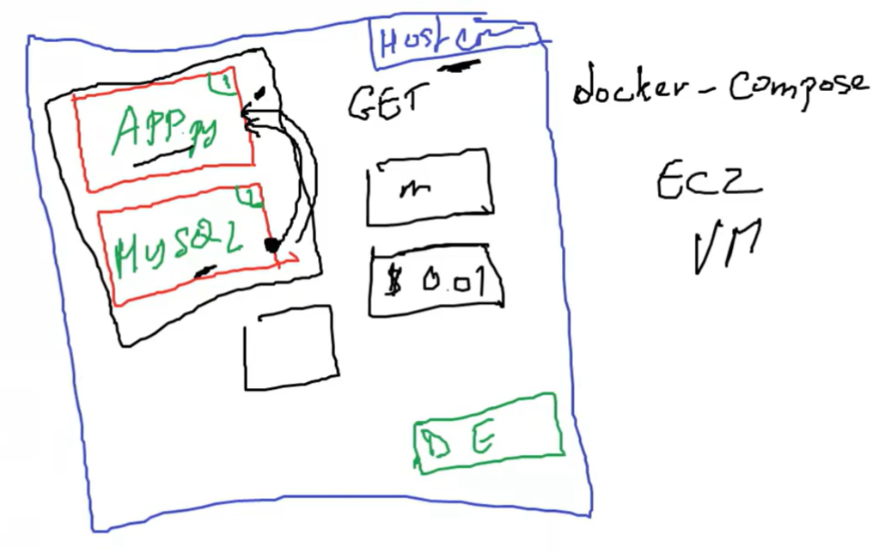
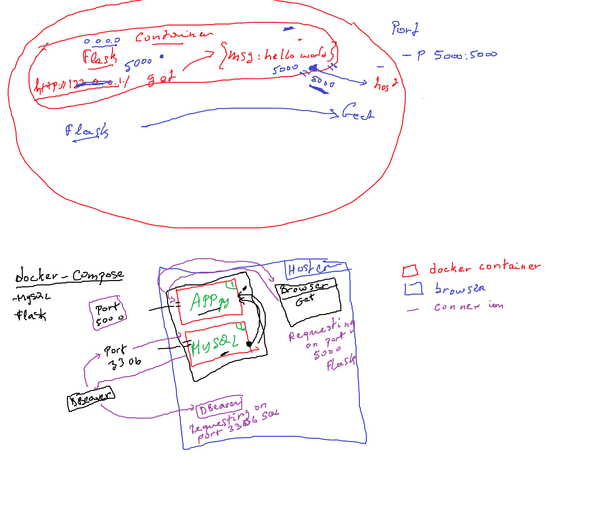

# Multi-Container Docker Application with Flask and MySQL




- This folder demonstrates how to use Docker Compose to manage a multi-container application. It includes a simple Flask web application that connects to a MySQL database.
- aim to have multiple docker compose on the same computer
- connect flask application with MySQL container
- when a GET request is made from the app will get everything from the MySQL app

## Project structure

multi-container-app/
│
├── app/
│   ├── Dockerfile
│   ├── app.py
│   ├── requirements.txt
│
├── db/
│   └── init.sql
│
└── docker-compose.yml

## description

- app/: Contains the Flask application.
  - app.py: The main Flask application file.
  - Dockerfile: Defines the Docker image for the Flask application.
  - requirements.txt: Lists the Python dependencies.

- db/: Contains the initial SQL script for setting up the MySQL database.
  - init.sql: SQL script to initialize the database and table with sample data.

- docker-compose.yml: Defines the services (Flask and MySQL) and their configurations.

## process

- python -m venv docker_venv
- . .\docker_venv\Scripts\Activate
- pip install flask
- pip list
- pip freeze > requirements.txt

### db

- we want table to be created
- initial querys to run in docker container
- in init.sql

1. Create a Database called Docker_practical.
2. Use Docker_praactical
3. Create Table in DB, called customers. Storing ID and Name
4. Insert initial values

### App

- Flak App
- create env_variables.py
- create /data endpoint
  - connect to MySQL database

```py
connection = mysql.connector.connect(
        host=HOST_DB,
        port=DB_PORT,
        user=ADMIN_USER,
        password=os.getenv('MYSQL_ROOT_PASSWORD'),
        database=DB_NAME,
    )
```

- store variables values in env_variable.py file
- create coursur
  - allows you to come in and out of db and grab the information needed

## Docker command

- Docker -v
- docker ps
- docker ps -lsa
- docker images
- Create Dockerfile
- (**FROM, WORKDIR, COPY, RUN, EXPOSE, CMD**)
- docker build -t python_flask .
  - builds docker file image tagging it with name of python_flask
- docker run --name python_flask_container python_flask
- docker exec -it <id> bash
- docker rmi <id> --force
- docker builder prune
- docker run --name python_flask_container -p 5000:5000 python_flask
- **docker images**: List docker images
- **docker ps**: Lists running containers
  - docker ps -a : Lists all containers, including those that are stopped.
  - docker ps --filter "status=exited" : Filters containers based on a specified condition.
  - docker ps -q : Outputs only the container IDs.
- **docker build**: Builds an image from a Dockerfile
  - docker build -t <image-name> <path-to-dockerfile> : Tags the built image with a specified name
  - docker build -f <dockerfile-path> <context-path> : Specifies a custom Dockerfile for the build.
    - docker build -f ./Dockerfile.custom -t custom_app . :Uses Dockerfile.custom to build the custom_app image.
  - docker build --no-cache -t <image-name> <path-to-dockerfile> : Builds the image without using the cache.
- **docker pull**: Downloads images from public registries (e.g.Docker Hub)
- **docker run**: Creates and starts a container from an image
  - docker run -d <image-name> : Runs a container in detached mode (in the background)
  - docker run -it <image-name> /bin/bash : Runs a container interactively with a terminal session.
  - docker run -p <host-port>:<container-port> <image-name> : Maps a container’s port to a host port.
    - docker run -p 8080:80 nginx : Maps port 80 in the nginx container to port 8080 on the host machine.
  - docker run --name <container-name> <image-name> : Assigns a name to the container.
  - docker run -e <key>=<value> <image-name>: Sets environment variables in the container.
  - docker run -v <host-path>:<container-path> <image-name> : Mounts a volume by mapping a host directory to a container directory.
    - docker run -v /my/host/data:/data my_app : Maps the host directory /my/host/data to the container directory /data.
  - docker run --rm <image-name> : Automatically removes the container when it stops running.
- **docker stop**: Stops a running container
- **docker exec**: Run commands inside a container
- **docker rm**: Removes stopped containers.
  - docker rm -f <container-id> : Forces the removal of a running container.
  - docker rm --volume <container-id> : Removes the associated volumes when removing a container.
- **docker logs**: View logs generated by a container.

## nano

- apt update
- apt install nano
- nano docker_app.py
- exit