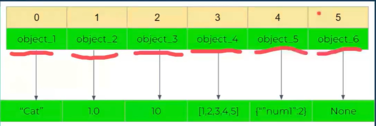

# Multidimensional Lists

- in python lists act like book shelves
- help you keep related items togethere
- e.g. list of fiction books or non-fiction books
  
## list Fundamentals

- 1 byte = 8 bit
- empyt vvariable in python is huge
- e.g. boolean = 24 bytes in pyton -> 1 byte in c++
- list (array) 1 type of data = 40 bytes in python
- tuple = 24 bytes
- in computer you have RAM -> has memory slots called bit -> 8 Bit = 1 byte
- 8 bytes = 64 bit
- in RAM you have memory addresses
- when post decidess to send you a letter they will refer to memory address
- e.g number "9" is an integer. integer is 24 bytes in python , so will need to take up 24 positions in memory to be allocated
- lists in python are stored in a contigous manner
- can recieve any type of variable types in a list
  - each cell in a list stores the refrence of each number item inserted in it
  - can store any data type in the list e.g. sting, integer, float .....
  - 
  - list is a bookshelf that you can store objects in
  - so variables are refered to as objects
- python is an interpretive language -> variables are generated on the go
- **Container**: group of items stored in the same memory block -> contains refence to other objects instead of data E.G. list, dictionary, tuple
- **List**: container created by surronding a dynamic typed array sequence of variables with a bracket [] or list ()
- **Element**: is a list item aslo refered to as a call
- **index**: in a list refers to the position of the element withing a list. usually starts from 0
- **Mutability**: ability to modify a data structure at runtime. A list is Mutable data struvture in python

## 1D list

- make up other lists

```py
myList = ["cat", 1.0, 10,[1,2,3,4,5,], {"num1":2}, None]
myList[2] # returns 10
my_list = list() # empyt list
my_list.append(3) # adds to list
my_list.append(5) # adds to list
my_list.pop() # remving an element in a list
My_list[0]="house" # adding "house" to index 0
your_list= ["monday", True]
my_list.extend(your_list) # extend your list using .extend() is an inplace function, modifu list on the spot
new_list = my_list + your_list # similiar to extend but not inplace
let new_list =[None]
let counter = 10
# to have 10 slots in new_list with None
new_list * counter
# output : [None,None,None,None,None,None,None,None,None,None]
counter =10
let new_list = [x for x in range(counter)]
# result [1,2,3,4,5,6,7,8,9]
## slicing
new_list = [start; end; step]
new_list = [0,1,2,3,4,5,6,7,8,9]
new_list = [0:5:2]
# 5th item is not part of slicing
# result [0,2,4]
new_list[::-1] # reversing the list
# result [9,8,7,6,5,4,3,2,1,0]
```

## 2D Lists

- 1D list that has Lists withing it
- each cell in the list referes to another python list

```py
new_list = [[1.0,"cat",3],[4,"fish",6],[7,"car",6.0]]
new_list[1][1] # output fish
```

## 3D Lists

- 2D list that has Lists withing it
- each cell in the list referes to another python list
- nested list
- 

```py
new_list = [[[1.0,"cat",3],[4,"fish",6],[7,"car",6.0]],
            [[12.0,"crazy",3.5],[4.2,"fast",44],[37,"carpet",36.0]],
            [[12.0,"tree",23],[40,"fightt",633],[72,"crash",56.0]]]
new_list[1][1][2] # output 44
# matrix itme = [row_index][column_index][last_index]
```