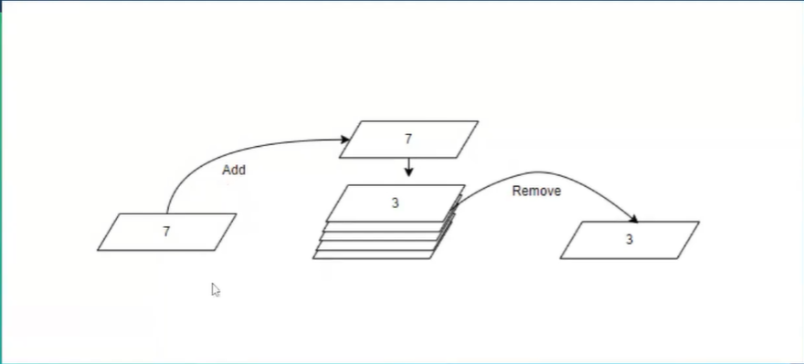

# sorting and searching

## abstract_data types

- **Algorithm**: A step-by-step procedure for solving a problem
- abstract data types: way of understanding a conceptual absstraction
- **queues**: first in first out
- **Stack**: last in first out, E.G. Undo button
- **trees**: main node called a root, with subsequent nodes connected to it as parents
- 
- part of python queue package
- import and external library
- follow the first in first out principle
- is a type of linked list

```py
from queue import Queue

# creating a new queue
students = Queue()

# adding students to the queue
students.put("Alice")
students.put("Bob")
students.put("Charlie")

# iterating over all sstudents
while not students.empty():
    # get currrent student, remving them from the que 
    current_student = students.get()
    print(current_student)
```

- **stacks**: a list in pyton can be used as stacks
- Last In First Out
- E.G. stack of paper on your desk

```py
# stacking
my_pets = []
#add 3 entries to the stack
my_pets.append("dog")
my_pets.append("cat")
my_pets.append("fish")
print(my_pets)
#remove the last element from the stack
my_pets.pop()
print(my_pets)
```

- **Graphs**: relationship betwenn multiple elements
- e.g. on linkein when you follow someone you see suggestion on who to follow based of this
- Vertex= different people listed
- edge= line that shows relationship between each person

- **Trees**:Family tree of a buisness structure
- start of with a node = starting point
- then have children -> grow off from the node
- leaf -> last set of data that apears in the tree
- Node-> parent -> child -> tree

## data structures to store abstract Data types

- **Arrays**: stores a variable number of elements of any type
- collection of variables
- Declaring lists:
- my_arr=[]

```py
my_arr=[]
my_arr=[1,2,3,"4"]
print(dir(my_arr))
print(len(my_arr))
my_arr=[0] = 2
my_arr=[-1] # this will get you the last eement 4
my_arr=[-2] # this will get you the second to last element 3
my_arr=[1:3] # this will get you the 2nd to 4th eement 2,3,4
my_arr=[::-1] # reverse an list
```

## sorting and searching data

- Algorithm: clear defined way of solving a problem
- set of instructions that can be followed to solve a problem and repeated to solve similiar problems
- Big O Nation: evaluate and describe the efficent of code
- also called Landau's Symbol
- f(x)=O(g(x))
- O(log n) & O(1) -> best performance
- O(n!) & O(2^n) -> worst for larger data

## Bubble Sort

- larger values bubble towards the top of the list
- comparing item "a" with the next item to it "b". If "a" is bigger than "b" they swap places. Then i move to the right and repeat
- This continoues untill all the items in the list have been sorted, and then the rocess starts again
- this happens as many times as one less than the length of the list
- E.g.
8, 3, 1, 4, 7 -> **First Iteration** : 5 numbers un random order
3, 8, 1, 4, 7 -> 8>3 so 8 & 3 swap
3, 1, 8, 4, 7 -> 8>1 so 8 & 1 swap
3, 1, 4, 8, 7 -> 8>4 so 8 & 4 swap
3, 1, 4, 7, 8 -> 8>7 so 8 & 7 swap
3, 1, 4, 7, 8 -> **Second Iteration**
1, 3, 4, 7, 8 -> 3>1 so 3 & 1 swap
1, 3, 4, 7, 8 -> 4>3 so they stay in place and iteration ends

```py
def bubble_sort(arr):
    for i in range(len(arr) -1, -1, -1):
        for j in range(1, i + 1):
            if arr[j - 1] > arr[j]:
                #swap the values
                arr[j -1], arr[j] = arr[j], arr[j - 1]
    return arr
```

```py
def bubble_sort(arr, size):
    #n = size of the array
    # first for loop is for the first iteration 
    for i=0 to n-i-1
        for j=0 to n-i-2
            if arr[J] > arr[J+1]
                Swap arr[j] and arr[j+1]
```

## insertion Sort

- take an item compare it to the ones sorted
- and swaps if smaller
- splitting array into 2
- left side sorted
- right unsorted

## selection sort

- takes first position and moving smallest number in the array into this position
- then second position, look at all the numbers to find the smallest value and then swaps areoun
- and does this for every position in our list

## searching

- linear search: searching through a list -> O(n) -> linear time complexity
- binary search: searching through a sorted list -> halfing the list and searching for greater than or less than
- 

## Quick Sort

- fast sorting algorithm
- set a pivot point , can be 1st number
- then look at next element, if its bigger than pivot point it stays on the right , if smaller than pivot point it goes to the left
- do this for every number in the list
- so have divided the array into values less pivot , pivot and values greater than pivot
- so now a new pivot point for number furthest to the left and closest right

```py
# quick sort
def quick_sort(arr, low, high):
    if low < high:
        # partition the array
        mid = partition(arr, low, high)
        # sort the left and right subarrays
        quick_sort(arr, low, mid - 1)
        quick_sort(arr, mid + 1, high)
    return arr

def partition(arr, low, high):
    # select the rightmost element as pivot
    pivot = arr[low]
    
    #loop through the array. move items up or down the array so that they are in the proper spot with regard to the pivot point
    while low < high:
        # move right
        while low < high and arr[high] >= pivot:
            high -= 1
        
        if low < high:
            arr[low] = arr[high]
            while low < high and arr[low] <= pivot:
                low += 1
            if low < high:
                arr[high] = arr[low]
    arr[low] = pivot
    return low
```

## Merge Sort

- similiar to quick sort
- divide and conquer
- break list into 2, keep dividing until each element is on its own
- next we combine them two at a time and sorting as we go
- and keep combining and sorting
- 

```py

```

## complexity order

- representation of complexity of an algorithm
- O(1) constant time complexity
  - regardless of the inpt size
- O(log n) Logarithmic time complexity
  - very effecient
  - good for searching
- O(n) Linear time complexity
  - execution time grows linearly with input size
  - n is size of list
- O(n^2) quadratic time complexity
  - execution time grows quadratically with input size
  - bubble sort
  - nested iterations over input data
- O(2^n) Exponential time complexity
  - highly inefficent
  - brute force algorithm
- 