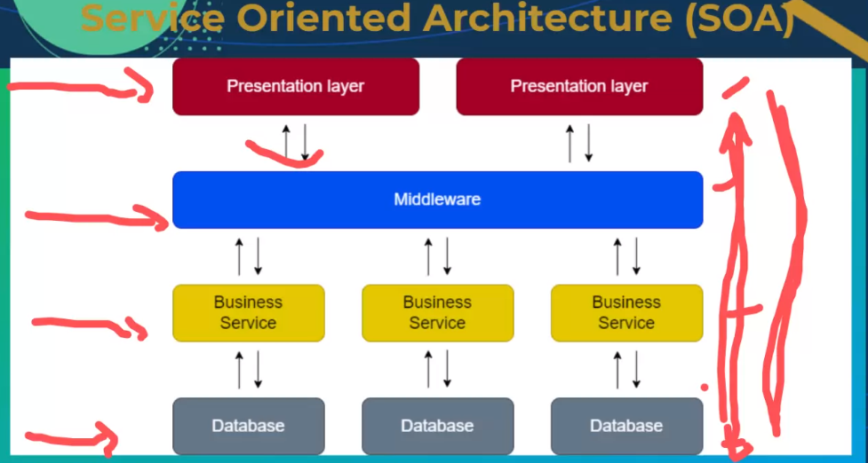
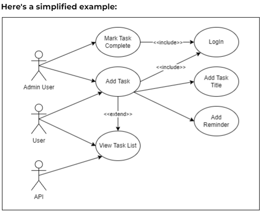

# Software Desighn

## modularisation

- breaking down complex systems into individual modules
- promotes maintanability by sustainability 
- swift removment and replacment of specific modules
- enhance colaboration
- Agile development of Application

## Object Oriented Programmming

- Break a problem to solvable pieces
- cat is an entity
- has some elements
- what can a cat do -> sleep , play, feed
- object = instance of a class
- class has multiple elements
- Presentation layer -> middlewars -> buisness service -> database
- 
- Cohesion and Coupling
  - coupling: degree of independence between modules
  - cohesion: measure of strength of relationship between functions in a class

## open/close principle

-
when you go to a bank you are a customer -> you have an age, name , CF number etc...
when you register as a company you give then the reg number and compliant
but banking system sees u as an entity .. have a account number , CIF name ....
modules building need to be open for modification and improvment. but closed enough so all the most important parts in your module should not be destroyed if it goes down 
E.G. calculator, module = display, digits, plus, minus, division

### Key Principles of Modularisation

- Independence: operate independently. minimising dependency on other components
- interchangability
- reusability
- encapsulation
- scalability

## Example

- Building Automation system
- Temprature controll module
- Lighting Control module
- Security Module
- Communication interface
- Each module operates independently, focusing on a specific aspect of the building automation system. This modular approach enhances the system's maintainability, flexibility, and overall robustness
- Advantaes:
- Ease of maintanece
- improved collaboration
- Scalability
- simplified Testing

## Use Case Analysis

- defining and explaining how users interact with a system to accomplish specific objectives
- This method captures real-world workflows and requirements, employing use case analysis diagrams to visually map plausible user-system interactions.
- These diagrams offer a high-level overview illustration of the functionalities users can engage within the system.
- A use case analysis diagram represents the interactions between actors (users or external systems) and the web application.
- helps us to visualise and understand how different actors interact with the system through various use cases
- birds eye view of what happens between the differen interactions
- **Users**: Actors represent entities outside the system that interact with it.
- Actors can be categorised into different roles, each having distinct interactions with the application.
- For instance, administrators, registered users, and anonymous visitors are common actor types
- **External systems**: Other systems or services that interact with the application, such as third-party APIs or databases
- **Use cases**: Use cases describe specific functionalities or tasks that actors can perform within the system. Each use case should be focused on a single action.
- Use cases often align with specific views or functions, such as user authentication or data manipulation. Examples of use cases in an application could include user authentication, data submission, and content retrieva
- **Association**: Associations represent relationships between actors and use cases.
- **Dependency**: Dependencies show the relationships between different use cases
- **Generalisation**: Generalisation represents inheritance relationships between use cases.
- **Include relationship**: "Include" relationships indicate that one use case includes the functionality of another
  - This could be seen when a higher-level use case, like "Manage Tasks," includes lower-level functionalities like "Add Task" and "Mark Task as Completed."
- **Extend relationship**: "Extend" relationships represent optional or conditional behaviour
  - This might be illustrated when a use case for adding a task can be extended with optional features like setting reminders or attaching files
- **System controller (optional)**: The system controller represents the mechanism or component responsible for coordinating the flow of information between actors and the application
example: 

## sequence diagram

- visually represents the chronological flow of messages and interactions among different components or objects in a system
- **Lifelines**: Vertical lines representing the entities involved in the sequence.
- Each lifeline corresponds to an object or component (user, view, database).
- **Messages**: Arrows indicating the flow of communication between lifelines.
- Messages can be synchronous (denoted by solid arrows) or asynchronous (denoted by dashed arrows), depending on whether they occur in a blocking or non-blocking manner.
- **Activation bars**: Rectangular vertical boxes along a lifeline that represent the duration of time during which an object is active or performing a task.

### sequence diagram components

- represents the flow of interactions between different components or objects over time
- **Users**: Represented as the initiator of the sequence, sending a message to add a task.
- **Views/Controllers**: Components that handle incoming requests and coordinate the flow of data and logic.
- **Models**: Representations of the application's software entities and business logic.
- **Templates**: Views responsible for rendering HTML and presenting data to users.
- **External systems**: Other systems or services that the application interacts with, such as databases, external APIs, etc.
- **Lifelines**: Lifelines represent the different participants (actors, components) in the sequence diagram. Each lifeline corresponds to a participant involved in the sequence of interactions.
- **Messages**: Messages depict the communication between lifelines. Messages could be HTTP requests, function calls, or any other communication between components. Messages can be synchronous or asynchronous.
- **Activation bar**: Activation bars represent the period during which a lifeline is active or engaged in processing a message. They show the duration of the interaction for a particular lifeline.
- **Return messages**: Return messages show the response or data flow back from the recipient to the sender.
- **System boundary**: Similar to what we did with the use case analysis diagram, you might include a system boundary to illustrate the scope of the application
- example: 
- in example the sequence diagram shows the flow of messages between the user, the view, and the database during the authentication and profile rendering process
- Each arrow represents a message, and the activation bars show when each component is actively processing the message
- The "Template” lifeline has an activation bar extending from the moment it initiates the "Add Task Request" message until it receives the "Add Task Response" message
- The "To-Do List View" lifeline has an activation bar that starts when it receives the "Add Task Request" message and continues through the "Validate and Save" process, ending after it sends the "Add Task Response" message to the user
- The "Database" lifeline has an activation bar starting when it receives the "Store Task" message and ending after it sends the acknowledgement back to the To-Do List View

- 
- sequence diagram are language agnostic
- 
- 
- get a loan example
- 

## Seperation of Concerns

- MVC is a design pattern commonly used in software development to organise code and separate concerns within an application. It is a conceptual framework that divides the application into three interconnected components: models, views, and controllers
- **Models**: Models represent the application's software entities and business logic. They encapsulate the data and define the rules and operations for manipulating that data
- Responsibilities: Receive data from the controller, process it, and return the result.Implement business logic related to the manipulation and processing of data
- Example: in the context of a to-do list application. You Define the Task model to represent tasks with attributes such as title, description, and completion status
- **Views**: Views are responsible for presenting the application's data to the user and receiving user input. Controllers render views using models
- Responsibilities:Handle user interface elements and interactions. Interact with the models for data retrieval and modification. Return appropriate responses, often by rendering templates
- Example: in the context of a to-do list application would be Displaying a task list or Accepting commands from the user to add tasks to the task list
- **Controllers**: Controllers act as intermediaries between the models and views. They receive user input from the views, interact with the models to process that input, and update the views accordingly
- Responsibilities: Handle user input and invoke corresponding actions on the models & Update views based on changes in the models
- Example: in the context of a to-do list application would be Handle user requests to add or delete tasks, and update the task list accordingly
- Example: 

## Class Diagram

- visual representation of the static structure within an application, illustrating classes, their attributes, and the relationships existing among them
- example: 
- Break down of classess:
- **Book Class**
- Attributes: title: String (private), author: String (private), ISBN: String (private)
- Methods: getDetails(): void (public)
- **Library Class**:
- Attributes: books-> List<Book> (private)
- Methods: addBook(book: Book): void (public) ; searchBook(title: String): Book (public)
- **Digital Book Class**:
- Attributes: title: String (inherited) ; author: String (inherited) ; ISBN: String (inherited)
- Methods: getDetails(): void (inherited from Book)
- **Refrence Book Class**:
- Attributes: title: String (inherited) ; author: String (inherited) ; ISBN: String (inherited); citations: List<String>
- Methods: getDetails(): void (inherited from Book); addCitation(citation: String): void
- arrows indicate the direction of associations
- solid arrow from Book to Library represents the Library having a list of books
- solid arrow from subclasses (DigitalBook and ReferenceBook) to Book indicates inheritance
- DigitalBook class has an additional method, getDetails
- ReferenceBook class has an association with Book, indicating it inherits and has an "is-a" relationship; in other words, a ReferenceBook is a Book
- “+” indicates public access, and “-” indicates private access

## CRUD Matrix

- document the relationships between different entities (usually database tables) 
- and the CRUD (Create, Read, Update, Delete) operations that can be performed on them

diagram for e commece system and process 