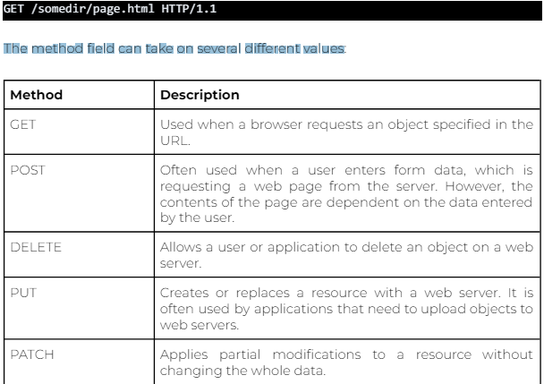

# HTML

- **URL** -> Universal Resource Locator
  - A URL is a type of Uniform Resource Identifier, or URI
  -
- **HTTP** -> HyperText Transfer Protocol
- provides structure and framework
- Hyper Text Mark Up Language
- HTML tags = fundamental building blocks
- opening and closing tags
- a paragraph element is <p> and closing tag </p>
- element is like a class in python
- Attributes are things that describe the objects created by HTML elements

## basic tags

- <html> -> root tag indicates the begining and end
- <head> -> metadata about the HTML document
- <title> -> displayed in the web browser
- <body> -> main content of HTML webpage

## layout

<html>
<head>
</head>
<body>
</body>
<html>
<main>
<section>

- <br> -> lne break
  - forces text or context to start on a new line
- <a> -> anchor elements
  - hyperlinks to locations with the same webpage , or other webpage
- <hr> -> Horizontal Rule
  - void element like BR but allows you to create a horizontal rule
- <ol> -> ordered lists
- <ul> -> un ordered lists Lists
- <li> -> list items
- <table> -> table
- <tr> -> row and cell

## html Tags Vs Attributes

- **Tags**: fundamental building blocks of HTML
- define structure of webpage
- **Attributes**: provide additional information about the object created by HTML elements
  - inside tags
- **Elements**: openeing and closing tags
- element is paragraph
- attribute is the id
- or ellement is image
- attribute is width, height, src, slt

## examples

```html
<a href="https://www.example.com" target="_blank">Visit Example</a>

<p id="jump-to-the">This is the paragraph to which we want to jump</p>
<a href="#jump-to-the">Jump to Paragraph</a>
```

## Text Formating Tags

- css rules will overide HTML formating
- heading tags <h1> to <h6>
- <p> -> paragraph
- ID values must be unique withing an element
- <strong> -> this is bold

## importance of HTML structure

- well organised maintanable and accessible web content
- SEO: Search enging optimisation
- consistency and Maintainability
- Performance Optimisation

## Seperation of Concersn (SOC)

- responsive desigh
- accessibility
- seperation of style
- to view HTML can use Live preview or Live server

## The HTTP Request- Responce Cycle:

- undamental process that occurs when a client communicates with a server over the web.
- This cycle involves a series of steps where the client sends a request to the server, and the server responds accordingly
- The user provides a client with a URL.
- The client then builds a request for information.
- The server receives this request and uses it to build a response that contains the requested information.
- The response is sent back to the client in the requested format to be rendered by the client.
- An HTTP request is a message sent from a client to a server to make a request for a particular resource or to perform a specific action.
- HTTP (HyperText Transfer Protocol) is the foundation of any data exchange on the web.
- The most common types of HTTP requests are GET and POST
- The first line in the HTTP request method is referred to as the request line, and the following lines are called the header lines
- request line consists of three fields:
- the method field
  - The method field can take on several different values
  - 
- the URL field
- the HTTP version field
- Header lines provide additional information about the request or the client making the request. They are key-value pairs separated by a colon

## HTTP Status Request

- HTTP status codes are three-digit numbers that are returned by a server in response to a client's request made to the server. These codes are grouped into different classes, each class having a specific meaning. Here are some of the common HTTP status code classes:

1. Informational Responses (100–199):
   ○ 100 Continue
2. Successful Responses (200–299):
   ○ 200 OK: The request succeeded, and the information was returned in
   the response.
3. Redirection Responses (300–399):
   ○ 301 Moved Permanently: The requested object has been permanently
   moved, and the new URL is specified in the Location: header of the
   response message. This will automatically be retrieved by the client.
4. Client Error Responses (400–499):
   ○ 400 Bad Request: Generic error code indicating that the request
   could not be understood by the server.
   ○ 404 Not Found: The requested document does not exist on this
   server.
5. Server Error Responses (500–599):
   ○ 505 HTTP Version Not Supported: The requested HTTP protocol
   version is not supported by the server.

## The method Attribute

- The method attribute specifies how the form data is sent to the page specified in the action attribute.
- There are two methods to send the form data as URL variables using the GET method or as an HTTP post-transaction using the POST method

**Data Submission:**

- GET: Appends data to the URL in the form of query parameters. Data is visible in the URL, and there is a limit to the amount of data that can be sent.
- POST: Sends data in the body of the HTTP request. The data is not visible in the URL, and there is typically no practical limit to the amount of data that can be sent.

**Security:**

- GET: Parameters are included in the URL, making them visible to users and potentially exposing sensitive information. It's not suitable for sensitive data, such as passwords or personal data.
- POST: Parameters are included in the request body, making them not visible in the URL. This provides a level of security, especially for sensitive information.

**Caching** involves storing previously retrieved data to enhance performance

- GET: Requests can be cached by the browser, and the URL can be bookmarked. It's generally more suitable for idempotent operations, where repeating the request has the same effect.
- POST: Requests are typically not cached, and the URL is not bookmarked. It is often used for non-idempotent operations, where repeating the request may have different effects.

**Idempotency** refers to the property where repeating an operation has the same result as performing it once

- GET: Generally considered idempotent because multiple identical requests will have the same effect as a single request.
- POST: Not necessarily idempotent. Repeating a POST request may have different effects, especially if it involves creating or updating resources.

- GET is often used for simple and idempotent operations, while POST is suitable for operations that involve submitting sensitive information or non-idempotent actions