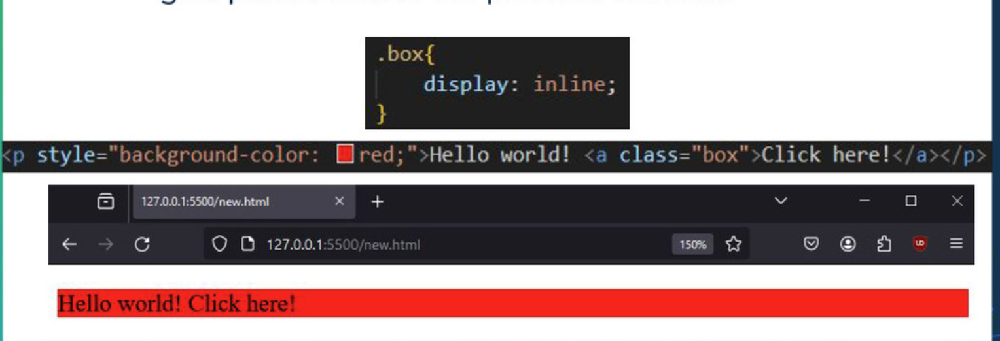
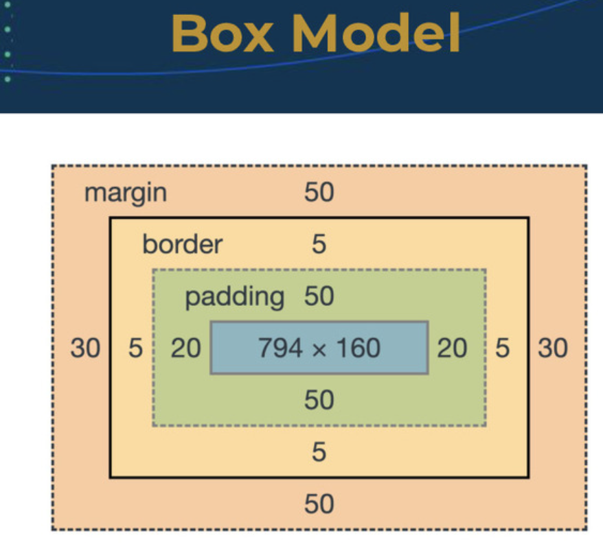

# CSS

- id selectors are only for a uniqe element
  - targeting 1 element
  - e.g. #end style can only tager one element that i give the ID to
  - class selector is for specicif elements

## Cascadiong Style rule

- internal CSS will always overide externall CSS
- as long as nothing else overiding external rule it will apply
- will only overide the property conflict

```css
  /* Cascade styles */
  p{
    font-size: 2.2em;
    font-family: 'Courier New', Courier, monospace;
    background-color: rgb(27, 20, 11);
}
```

- this is an element selctor
  - selects all p selectors

```css
  /* Cascade styles */
  .p{
    font-size: 2.2em;
    font-family: 'Courier New', Courier, monospace;
    background-color: rgb(27, 20, 11);
}
```

- this is an class selctor
  - selects all class i set

```css
  /* Cascade styles */
  #p{
    font-size: 2.2em;
    font-family: 'Courier New', Courier, monospace;
    background-color: rgb(27, 20, 11);
}
```

- this is an ID selctor
  - selects all ID set

## box model

- think off all elemts in our page as boxes
- helps with a much better layout
- block type and inline type
- different type of box we can edit
  - content
  - padding
  - border
  - margin
- block type will fill up the entire width of page
- everything by default is a block type
- **inline block**: takes up the width as long as the content is
  - dont have a line break before or after
  - 
- 

```css
}
  /* container for all my blocks */
    .container {
        width: 80%;
        border: 2px solid rgb(32, 19, 2);
        margin: 20px auto;
        padding: 20px;
    }
```

- to use this properly create a <div> then <body> and etc

## bootstrap

- open source css template
- predefined rules that can be used for our pages
- provides consistency accross pages
- 