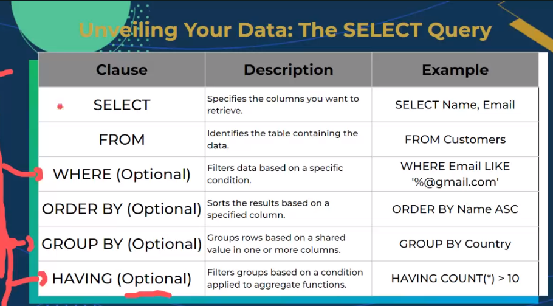
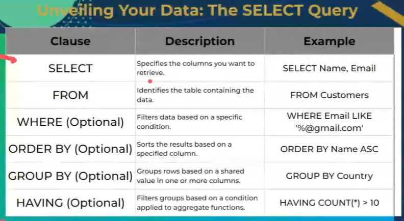
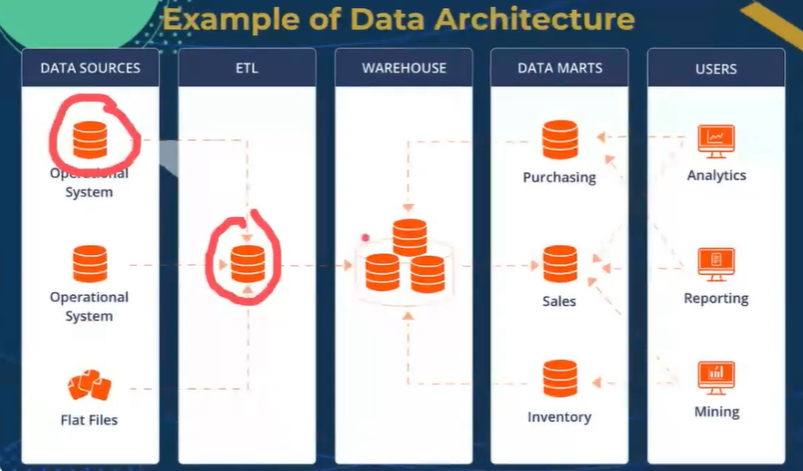

# Databases

- relational and non relational databasse
- store data un a structure format using tables with rows and column

## Schema

- configuration of database
  - table names and data types
- logical division of entire database
- database contains tables
- how database and tables are connected is schema

## Table

- single type of data
- organisation  of eeach and every one of the tables in a logical way
- organised structure of data in a vertical manner
- combination of row and collumns

## Columns

- set of elements that belong to a single row
- in a relationsal database they all have the same type

## rowas

- single insta of data
- also known as Record

## Data type

- single type for a relational Database
- Text: Varchar or TEXT
- numbers: INT or DECIMAL
- dates: DATE or TIMESTAMP

## Primary Key

- is a column
- uniquely identifies a dingle row
- relationships: link between 2 or multiple tables via the primary Key

## views

- replication of a true table

## indexes

- data structure that allows you to plan and execute querys

## SQL join

- you have
- left join: what ever is on the left remains -> 1-1 mapping but whatever is on the left that isn't on the right just convert to null
- right join: what ever is on the right remains
- full join: 1-1 mapping nd return only what exists

## ACID

- Atomicity
- Consistency
- Isolation
- Durability

## Normalisation

- streamlining your database
- Dont waste storage and are efficent
- 
- have data integrity
- efficency and maintanability
- Var char = string

## SQL fundametals

- Structure Query Language
- interact with database
- CRUD
- DDL = Data definition language
  - crete a database
- DML = Data Manipulation Language
  - manage data withing your database
  - So insert
- DCL = Data Control language
  - Controls Access Privileges
- Key words: 
- Select from where order by group by having

## In organised projects

- Data Lakes
  - reservoir for all your data
  - central repository
  - storing raw unstructured and semi-structured data
  - no sql
- Data warehouse
  - subject oriented centrally managed warehouse for analytical workloads
  - store detailed and integrated data from varoious sources. OLTP systems manage current operational data
- Data marts
  - subset of data warehouse
  - cleanest version of the data
- 

## maria DB

- heidis.SQL is a GUI for the DB
- [MYSQL](https://www.db-fiddle.com/)
- [MARIA DB](https://mariadb.org/)

```mariaDB
show databases;

CREATE DATABASE VehicleSalesDB;

use vehiclesalesdb;

 CREATE TABLE VehicleSales (
    -> sale_id INT AUTO_INCREMENT PRIMARY KEY,
    -> vehicle_id INT,
    -> customer_name VARCHAR(100),
    -> customer_contact VARCHAR(20),
    -> sale_date DATE,
    -> sale_amount DECIMAL(10,2),
    -> payment_method ENUM('cash', 'credit card', 'loan'),
    -> salesman_id INT,
    -> sale_location VARCHAR(100),
    -> review_rating INT
    -> );

show tables;

drop table vehiclesales
#deletes a table

INSERT INTO vehicleSales (vehicle_id,  customer_name, customer_contact,sale_date,sale_amount,  payment_method, salesman_id, sale_location,review_rating )
VALUES
(1, 'John Doe', '555-1234', '2024-05-17', 25000.00, 'Credit Card', 101, 'New York', 5),
(2, 'Jane Smith', '555-5678', '2024-05-18', 18000.00, 'Cash', 102, 'Los Angeles', 4),
(3, 'Alice Johnson', '555-8765', '2024-05-19', 22000.00, 'loan', 103, 'Chicago', 5),
(4, 'Bob Brown', '555-4321', '2024-05-20', 15000.00, 'Credit Card', 104, 'Houston', 3),
(5, 'Charlie Green', '555-8765', '2024-05-21', 27000.00, 'Credit Card', 105, 'Phoenix', 4);

SELECT * FROM vehiclesales LIMIT 2;

SELECT customer_name FROM vehiclesales LIMIT 2;
```