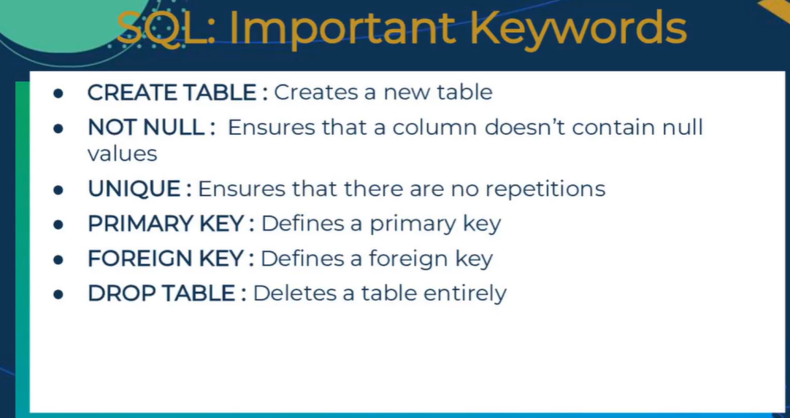
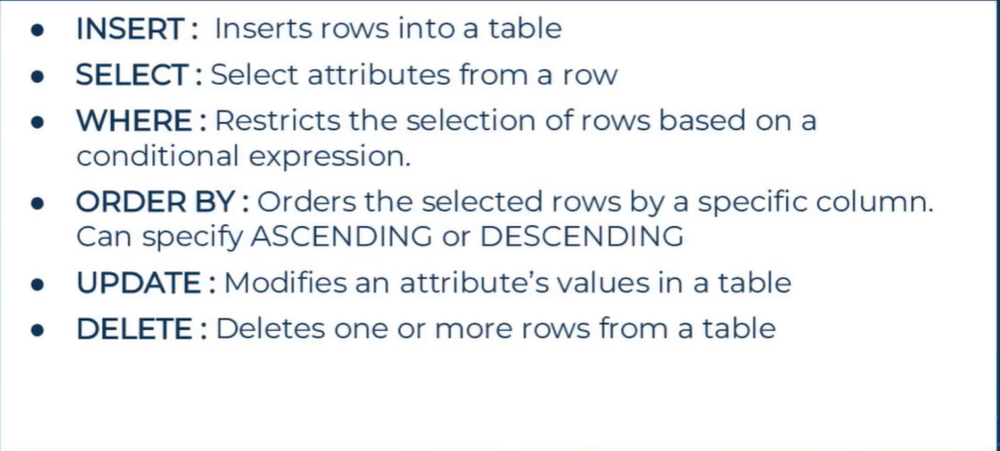
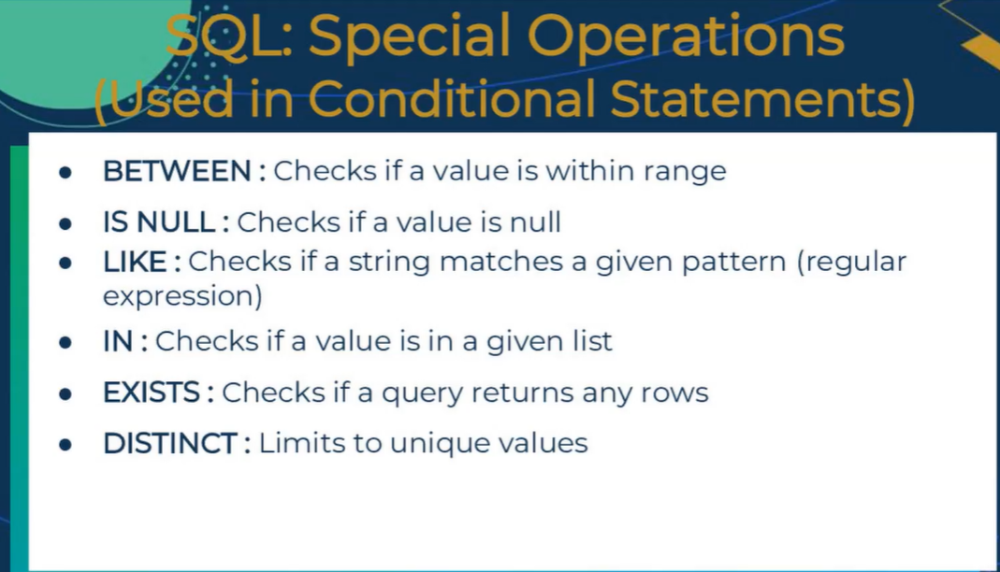
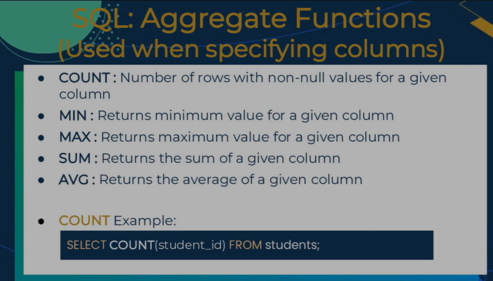
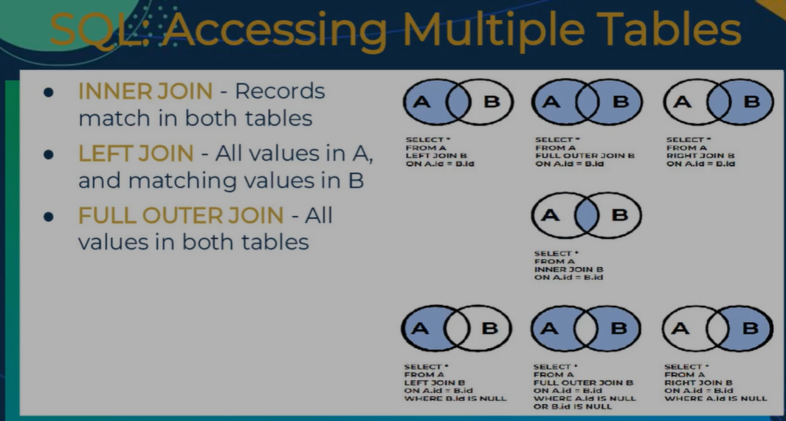

# connecting pyton and SQL

## understand database connectivity

- for data manipulation and analysis
  - dynamic managment and maintanece
  - real time updates
- Gives data Access
- Scalability
- security
- integration
- performance

## benefits of python for database connectivity

- ease of use
- library support
- cross-platform compatability
- data analysis and machine learning
- community support
- development capabilities

## SQLite

- lightweight self contained SQL database engine
- can also use SQLAlchamey
  - pip install sqlalchemy
  - ORM library -> object relationall mapping
-  

## what is SQL

- SQL stands for Structured Query Language
- create database or table structures
  - data manipulation or data administration
- Aspects of SSQ
  - DDL: Data definiton Language
    - Defines databases
    - Deines views
    - Defines access rights
  - DML: Data Maipulation Language
    - INSERT
    - UPDATE
    - DELETE
    - SELECT
  - SQL is easy to learn
    - simple vocabolary
  - Important Keywords: 
  - More keywords: 
  - 
  - 
  - 

```sql
CREAE TABLE table_name (
    column1_name datatype constraint,
    column2_name datatype constraint,
    column3_name datatype constraint,
);

INSERT INTO table_name (column1, column2, column3)
    VALUES (value1, value2, value3);

INSERT INTO table_name
    VALUES (value1, value2, value3);

SELECT * FROM table_name;

SELECT column1, column2:
    FROM table_name

SELECT * FROM table_name
    WHERE firstname='john';

SELECT * FROM table_name
    ORDER BY column1 DESC;

UPDATE table_name
    SET column1=value1, column2=vaue2
    WHERE condition;

UPDATE customers
    SET address='24 mapple road', city= 'vaue2'
    WHERE customer_id=1;

DELETE FROM table_name
    WHERE condition;

SELECT * FROM album
    WHERE genre IN ('pop','sould');

SELECT * FROM album
    WHERE released BETWEEN 1975 and 1985;

DROP TABLE table_name;
```