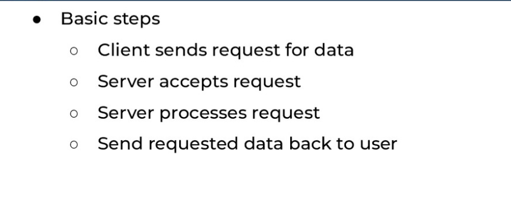
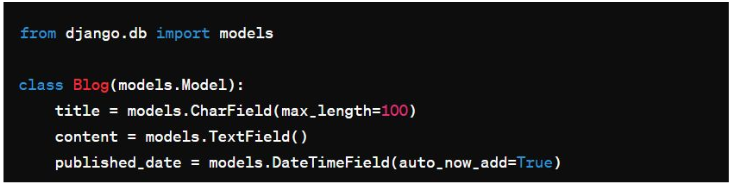
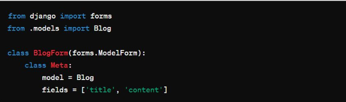

# Django

## Client-Server Architecture

- breaks down tasks and workloads between tasks and server
- Cleint send request for data
- server accepts request
- server processes requestserver sentd requested data back to user
- Servers
  - Requires correct software to be a server
- Cleints
  - requires correct software to make requests
  - apps are clients that serve one single website 
- 

## HTTP

- request responce cycle
- HTTP is a stateless protocol
- each request is independent from the previous request
- HTTTP Messages , used for request and responses
- encoded in ASCII
- Span multiple lines
- consists of
- Start Line
- Headers
  - general
  - request
  - representational
- Body

## Status Codes

- 100s
  - informational code
- 200
  - success
- 300
  - redrection codes
- 400
  - client side errors
- 500
  - server errors

## what is a web framework

- software framework designed to assist in the development of web applications
- What is Django
  - open source web framework
  - used for developing secure and scallable web applications
  - ORM - object relational mapping
- Flask is more low level
- Django prebuillds the file for us
- Why Django
  - large list of library and tools
- MVT - Model View Template Architecture
  - Models = data
  - View = processing/controller
  - Template = Presentation Layer/interactions

## install DJANGO

- python -m venv venv
- . .\venv\Scripts\Activate
- pip install django
- pip list
- pip freeze > requirements.txt
- **create DJANGO project ->** django-admin startproject my_project
- run server -> python manage.py runserver
- folder structure
  - settings.py -> settings of application
  - urls.py ->  path
- **create DJANGO app ->**django-admin startapp my_app
- in project -> settings -> INSTALLED_APPS -> add name of application E.G my_app

## django template language

- templates and html
- can create a base template and then extend on it
- inside of application folder
- for html a variable is {{}}
- a placeholder is 

## other tools

- Flask
  - need to set up a whole lot of things
  - Django : batterys included can start of the back
- Django
- Falcon
- Tornado
- FastApi

## Django Project

- The root directory of your application
start up script:
```django-admin startproject project_name```
Provides boiler plate template

"""python
 project_name/
◆ manage.py
◆ project_name/
● __init__.py
● settings.py
● urls.py
● asgi.py
● wsgi.py
"""

run project:
```cd project_name```
start Project:
```py project_name.py runserver```
start app:
```django-admin startapp app_name```
```py manage.py startapp my_app```

"""python
my_app/
◆ __init__.py
◆ admin.py
◆ apps.py
◆ migrations/
● __init__.py
◆ models.py
◆ tests.py
◆ views.py
"""

## Models

- Represent database tables as Python classes
- Define structure of the data, including fields and behaviors
- Use models to interact with the database
- Each model maps to a single database table
- 

## Forms

- Forms handle user input in Django applications
- Define the fields users can interact with and validate the
submitted data
make collecting and processing user input secure


## Migration

- track changes of your DB
- When you modify a model, migrations create instructions to update the database schema
- Track changes and roll back if needed
- ensures your database reflects your latest data structure

```python manage.py makemigrations```
```python manage.py migrate```

## Django admin

- Provides a web-based interface to your application’s data
- Built-in admin interface
- Automatically generates admin interface for registered models
