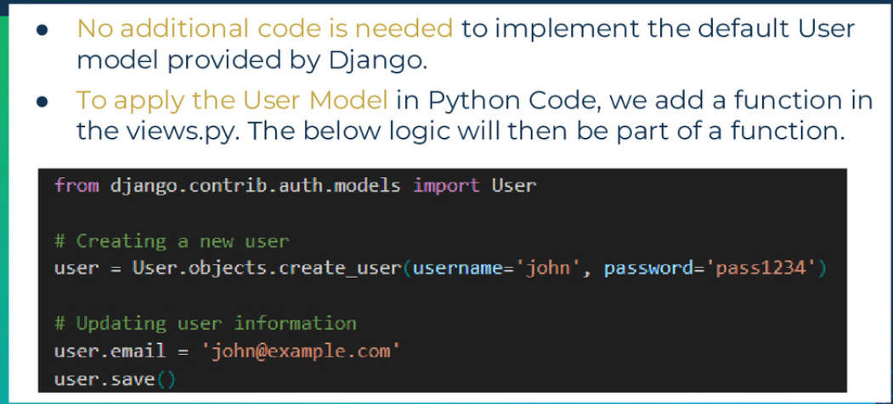
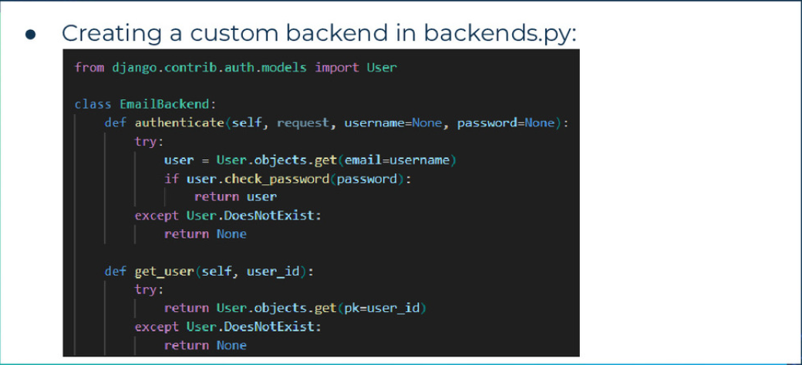
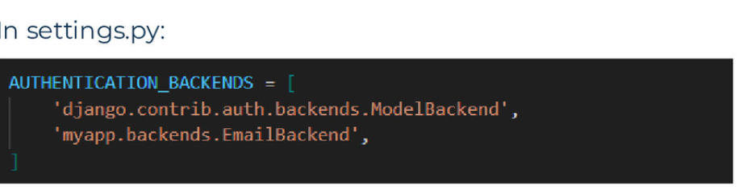
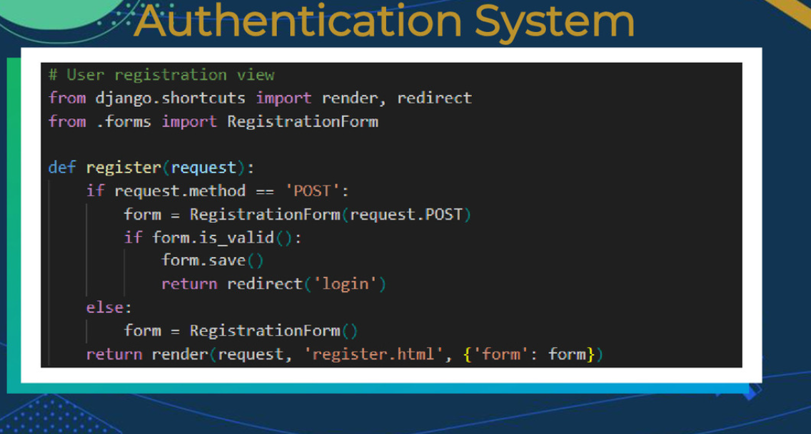

# Django part 2

## Agenda

Create a Django Project
2. Create a Django app
3. Implement Model and Logic
4. Implement forms, data handling
5. Retrieve data from both Template view

## process

- python -m venv venv
- . .\venv\Scripts\Activate
- pip install django
- pip list
- pip freeze > requirements.txt
- **create DJANGO project ->** django-admin startproject sticky_notes .
- run server -> python manage.py runserver
- folder structure
  - settings.py -> settings of application
  - urls.py ->  path
- **create DJANGO app ->**django-admin startapp sticky_notes_app
- in project -> settings -> INSTALLED_APPS -> add name of application E.G sticky_notes

## run project

- start Project:
```py project_name.py runserver```
```python manage.py makemigrations```
```python manage.py migrate```

- add urls.py to apps folder
  - import views.py from app directory
- modify views.py in apps folder
- modify urls.py in project folder
- add models.py in app folder
- add forms.py in app folder

## default user model






``` py
from django.contrib.auth.models import User

# creeating a new user 
user = User.object.create_user(username='ore', password='password123')

# updating user infformation 
user.email ='ore@example.com'
user.saave()
```