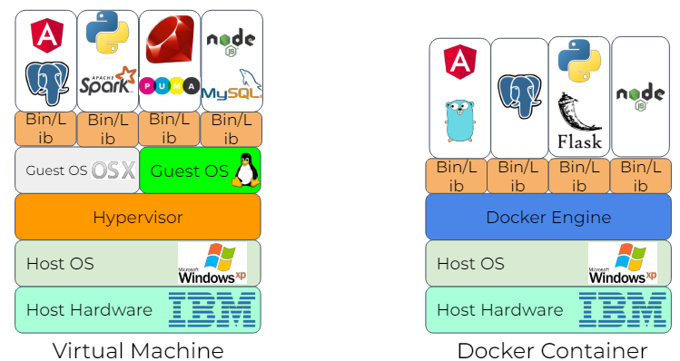
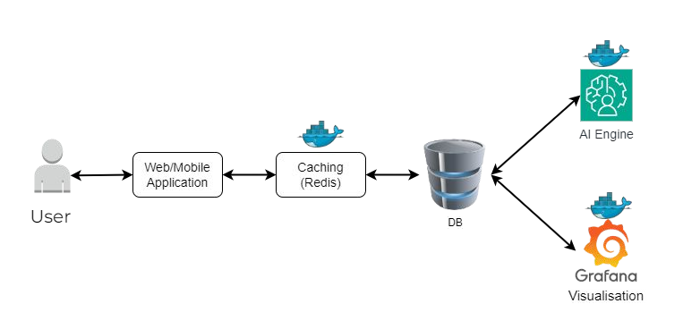

# Docker

## Problem been solved

- solves it works on my machine problem
- before docker we had Virtual Machines
  - Heavy, slow to start, and resource-intensive.
  - Had to : Select VM software -> Configure VM -> Create snapshot/export -> Share VM image -> Run and test in VM
- Also had Virtual Enviroment
  - Good for Python, but not always for other tools or languages.
  - Process Includes : Install Conda/Virtualenv -> Create isolated environment -> List dependencies -> Activate environment -> Sync and verify
- Now docker
  - push code to github
  - create docker image -> Blue print of Application

## Containerisation

- Containerisation is the packaging of software code with just the operating system (OS) libraries and dependencies required to run the code to create a single lightweight executable—called a container—that runs constantly on any infrastructure. It is also referred as lightweight virtualization.
- lightweight virtuilization
- What is included in a container
  - Code, Coonfigs, Runtime, Enviroment, Libraries

| Aspect | Containers | Virtual Machines |
|----------|----------|----------|
| Resource Usage | Lightweight, efficient | Heavier, more resource usage |
| Startup Time | Quick start | Slower start |
| Isolation | Process-level separation | Full OS isolation |
| Portability | Highly portable | Compatibility concerns |
| Resource Overhead | Minimal overhead  | Higher overhead |
| Isolation Level  | Lighter isolation | Stronger isolation |

## Docker container

- Host hardware (infrastucture) -> Host OS -> Docker Engine -> Contianer
- 
- docker container rely on docker engine instead of hypervisor
- **hypervisor** = orchestrator of VM
- **Kernel** -> for communication to different containers
- docker container is an instance of docker image

## Docker Benefits

- **Consistency**: Ensures applications run the same way everywhere.
- **Isolation**: Containers are isolated from each other and the host system.
- **Efficiency**: Containers are lightweight and share the host kernel, making them resource-efficient.

## Core concept

- **Images**: Blueprints for containers, containing application code, libraries, and dependencies.
- **Containers**: Instances of images, isolated environments running applications
- **Dockerfile**: A text file with instructions to build images (**FROM, WORKDIR, COPY, RUN, EXPOSE, CMD**). It specifies:
  - Base image: The starting point for the image.
  - Instructions: Commands to install dependencies, copy files, and configure the environment.
- **Docker daemon**: A background service that manages Docker objects (images, containers, networks, volumes).
- **Docker Hub**: A public registry for sharing and discovering Docker images.
- no relationship between container and host
  - need to open a port so they can speak to each other
  - 

```docker
FROM python:3.9-slim
# create a folder caled app
WORKDIR /app
# copy everything from directory to app
COPY . /app

RUN if [ -f requirements.txt]; then pip install --no-cache-dir -r requirements.txt; file

Expose 80

CMD ["python", "app.py"]
```

## Docker commands

- **docker images**: List docker images
- **docker ps**: Lists running containers
  - docker ps -a : Lists all containers, including those that are stopped.
  - docker ps --filter "status=exited" : Filters containers based on a specified condition.
  - docker ps -q : Outputs only the container IDs.
- **docker build**: Builds an image from a Dockerfile
  - docker build -t <image-name> <path-to-dockerfile> : Tags the built image with a specified name
  - docker build -f <dockerfile-path> <context-path> : Specifies a custom Dockerfile for the build.
    - docker build -f ./Dockerfile.custom -t custom_app . :Uses Dockerfile.custom to build the custom_app image.
  - docker build --no-cache -t <image-name> <path-to-dockerfile> : Builds the image without using the cache.
- **docker pull**: Downloads images from public registries (e.g.Docker Hub)
- **docker run**: Creates and starts a container from an image
  - docker run -d <image-name> : Runs a container in detached mode (in the background)
  - docker run -it <image-name> /bin/bash : Runs a container interactively with a terminal session.
  - docker run -p <host-port>:<container-port> <image-name> : Maps a container’s port to a host port.
    - docker run -p 8080:80 nginx : Maps port 80 in the nginx container to port 8080 on the host machine.
  - docker run --name <container-name> <image-name> : Assigns a name to the container.
  - docker run -e <key>=<value> <image-name>: Sets environment variables in the container.
  - docker run -v <host-path>:<container-path> <image-name> : Mounts a volume by mapping a host directory to a container directory.
    - docker run -v /my/host/data:/data my_app : Maps the host directory /my/host/data to the container directory /data.
  - docker run --rm <image-name> : Automatically removes the container when it stops running.
- **docker stop**: Stops a running container
- **docker exec**: Run commands inside a container
- **docker rm**: Removes stopped containers.
  - docker rm -f <container-id> : Forces the removal of a running container.
  - docker rm --volume <container-id> : Removes the associated volumes when removing a container.
- **docker logs**: View logs generated by a container.

## Examples

- App relys on AI engine
  - this sits in docker continer created from docker image
  - good for scale
  - Grafana for Visualisation -> E.G. PowerBi
  - Communicate with DB
  - then have caching (redis)
  - 
- Docker in Real Life Scenarios
  - Simplifying development and testing environments
  - Running microservices.
  - Deployment in continuous integration/continuous deployment (CI/CD) pipelines.
- Example Applications
  - Python web applications (e.g., Flask, Django).
  - Database management.
  - CI/CD

## Refrences

- [Get Started](https://www.docker.com/get-started/)
- [Docker 101](https://www.docker.com/101-tutorial/)
- [Docker Manual](https://docs.docker.com/manuals/)
- [Docker CLI Cheat sheet](https://docs.docker.com/get-started/docker_cheatsheet.pdf)

## process

- python -m venv venv
- . .\venv\Scripts\Activate
- pip install flask
- pip list
- pip freeze > requirements.txt

### postman

- new http reuest
- GET: http://127.0.0.1:5000

## Docker

- Docker -v
- docker ps
- docker ps -lsa
- docker images
- Create Dockerfile
- (**FROM, WORKDIR, COPY, RUN, EXPOSE, CMD**)
- docker build -t python_flask .
  - builds docker file image tagging it with name of python_flask
- docker run --name python_flask_container python_flask
- docker exec -it <id> bash
- docker rmi <id> --force
- docker builder prune
- docker run --name python_flask_container -p 5000:5000 python_flask

## nano

- apt update
- apt install nano
- nano docker_app.py
- exit

## Git

- **Commit**: A wrapper for a set of changes
- **Staging Area**: A file containing changes to be added to the next commit.
- **Version**: Code at a particular state.
- **Repository**: The collection of all files at all versions.
- **Repository**: is a central storage location for managing and tracking changes in files and directories
- **Commit**: The core conceptual unit of work in Git is the commit. These are snapshots of the files being tracked within your project folder.
- **Branch**: Branching lets you work with multiple chains of commits inside a project.
- **Clone**: Copies or downloads the repository from GitHub.com to your local machine
- **Pull**: Used to fetch and download content from a remote repository and immediately update the local repository to match that content.
- **Push**: used to upload local repository content to a remote repository.
- **Status**: shows the current state of your Git working directory and staging area.
- Most widely used version control system.
- Free and open-source. Designed to handle a large variety of systems.
- Distributed architecture: When you download a repository, you download the full history of changes to your local computer.
- Everything is run from the command-line using the git application.

## branching stratergy

- release branch goes directly to master branch
