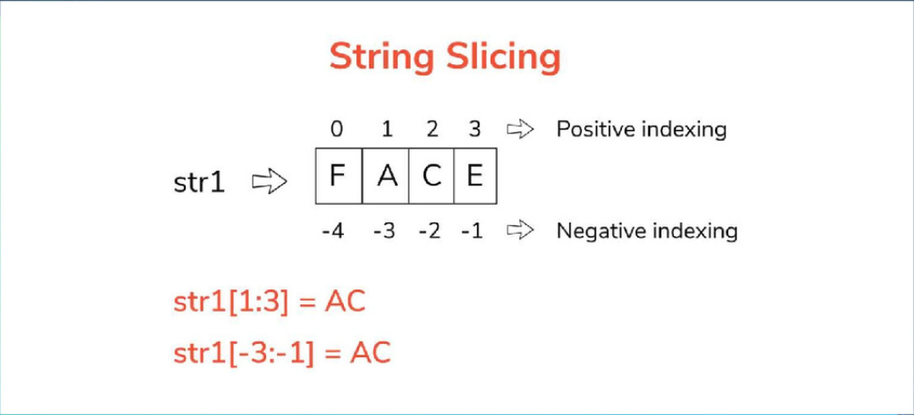

# sequences

## Basic String Methonds

.capitalize()
.isalpha()
.isnumeic()
.isupper()
.split()
.title()
.strio()
.replace("d", "m")

- strings are immutable
- objects cannot be changed
- store the changes we made in a variable to be reused
- you dont take the last numbe str [1:3] is only 1st and 2nd value



## string concatentation & formatting

- joining and adding string
- string concatenation
"hello"+"word"= "helloword"
- string formating

```py
name = "ore"
quantity =51
formatted_string = "my name is {} and i want {} muffins please.".format(name, quantity)
formatted_string= (f"Nobody expects the {namme}")
```

## lists

- muttable
- values inside list can be changed
- e.g my_list = [value1, value 2, value 3]
- append()
- insert()
- remove()
- pop()
- del()
- sorting()
- reversing()
- slicing()

```py
numbers= [1, 2,3, 4, 5]
fruits =["apple", "bannan" , "orange"]
mixed_list= [1, "apple", True , 3.14]
fruits.append("grape")
# adds a single item at end of list 
fruints.extend(["pinneapple", "mango"])
fruits.remove("banana")
removed_item=fruits.pop(2)
numbers.sort()
fruits.sort(reverse=True)
sorted_numbers=sorted(numbers)
```

## Dictionaries in python

- Key : value
- word and definition -> like dictionary
- written wwith curly brakets
- get()
- update()
- 

```py
my_dictionary={
    "name":"ore",
    "age":24,
    "is_funny": True
}
```

```py
my_dict = dict(name="kitty", age=34, city="london")
print(my_dict)
my_dict.update({'breed':'Shorthair'})
print(my_dict)
my_dict['breed']= 'shorthair'
print(my_dict)
```

## scaffold Python

- makefile
- script-> hello.py
- requirement.txt
- text
- virtual enviroment
- run with a Build Server -> Github Actions
- step 1 create python virtual enviroment
  - python3 -m venv ~/.lecture1
- Step 2 create scafolding
  - touch Makefile
    - build a command that wraps up a process for install, test, lint, all . can put any commands you want inside
    - can then type -> make install -> runs install commands -> like a bash script
    - lint:
    - pylint
  - sourrce code file-> touch hello.py
  - touch requirements.txt
    - pylint
    - pytest
  - test -> touch test.py
