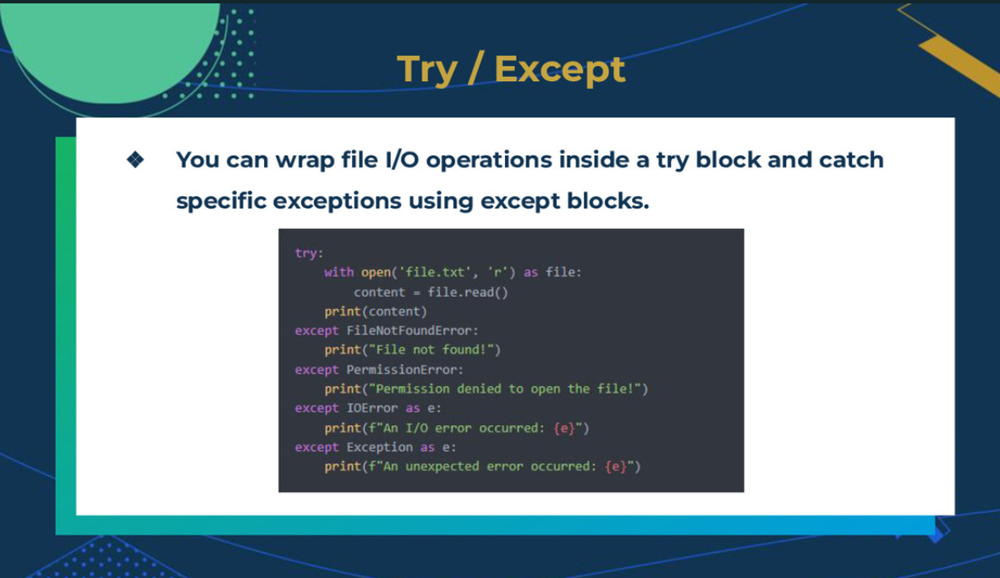
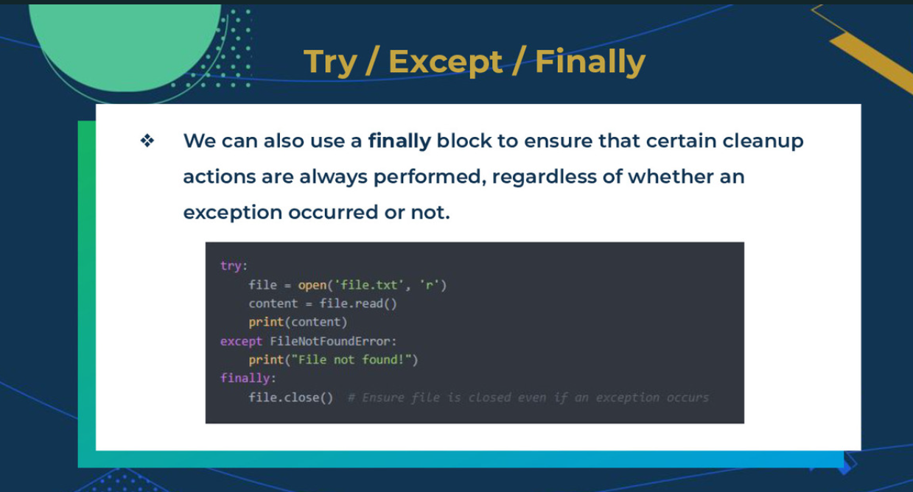

# File input output

File Handling:

- File modes; specifications used when opening a file to indicate the specif operations
- file handling: way we take in information to the text file

File Modes:

- r = reading
- w = writting
- a  = append mode
- `+` = reading and writing performed using `open(<file>,mode)`

implicit Method:

- with statment

```py
with open ('filenam.txt','r') as file:
    conent = file.read()
```

```py
file = open ('filenam.txt','r')
content = file.read()
file.close()
```

file handling

- write ne item to the file
- write a list

